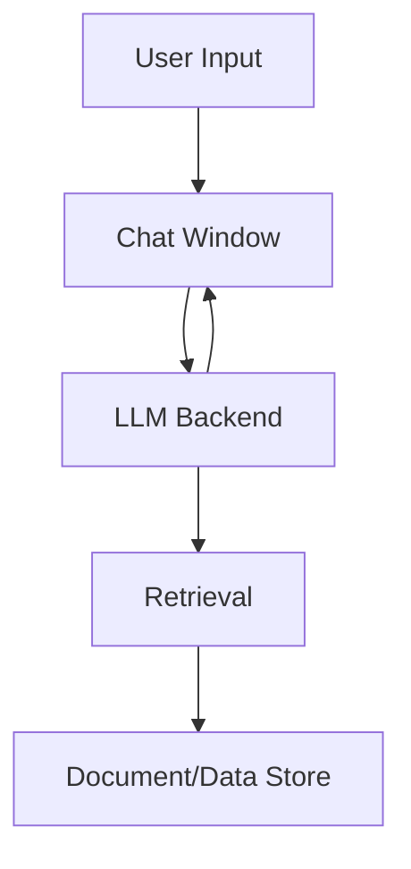

# System Architecture & Flow

```mermaid
flowchart TD
    UserInput[User Input (UI)] --> ChatWindow[Chat Window (Streamlit)]
    ChatWindow --> RBAC[RBAC & Routing (query_router.py)]
    RBAC --> Audit[Audit Logging]
    RBAC --> LLMBackend[LLM Backend]
    LLMBackend --> Retrieval[Semantic Retrieval (FAISS + SentenceTransformers)]
    Retrieval --> LLMBackend
    LLMBackend --> ChatWindow
    RBAC --> ChatWindow
    ChatWindow --> Audit
    subgraph Data
        VectorDB[vector_db/metadata.csv, .index]
        MockDocs[mock_data/]
        Ingest[ingestion/]
    end
    Retrieval --> VectorDB
    Retrieval --> MockDocs
    Ingest --> VectorDB
    Ingest --> MockDocs
    LLMBackend --> MockDocs
    ChatWindow --> RBAC
    RBAC --> LLMBackend
    LLMBackend --> ChatWindow
    LLMBackend --> ChatWindow
```
```mermaid
flowchart TD
    subgraph UI
        A1[User Input]
        A2[Chat Window (Streamlit)]
        A3[Role Selection]
    end
    subgraph Backend
        B1[RBAC & Routing (query_router.py)]
        B2[LLM Backend]
        B3[RAG Pipeline]
        B4[Audit Logging]
    end
    subgraph Data
        D1[vector_db/metadata.csv, .index]
        D2[mock_data/]
        D3[ingestion/]
    end
    A1 --> A2
    A2 --> A3
    A2 --> B1
    A3 --> B1
    B1 --> B4
    B1 --> B2
    B1 --> A2
    B2 --> B3
    B3 --> D1
    B3 --> D2
    D3 --> D1
```
    B3 -->|Retrieve| D2
    D3 --> D1
    D3 --> D2
    B2 -->|Answer| A2
    B2 -->|Onboarding/SOP/Salary| D2
    A2 -->|Feedback| B4
```


# Local AI Chatbot POC - Architecture (v1.0.4)

## Overview
This document describes the architecture, components, and deployment strategies for the Local AI Chatbot POC. The design is inspired by the structure and best practices of the agentic-mortgage-research project.


**Version:** v1.0.4 (March 2026)
## Key Components
- **ui/app.py**: Main Streamlit app, chat UI, sidebar/documentation, RBAC logic, onboarding, and salary extraction.
- **llm_backend/**: Business logic, LLM service, RAG pipeline, RBAC service, and data utilities.
- **ingestion/**: Scripts for document ingestion, chunking, and embedding.
- **vector_db/**: Stores metadata and vector index for document retrieval.
- **mock_data/**: Sample HR, Technology, and Training documents.
- **tests/**: Unit and integration tests for chatbot logic and RBAC.


## Data & Service Flow
1. User interacts with Streamlit UI (`ui/app.py`).
2. Query is routed to `query_router.py` for RBAC and intent detection.
3. If allowed, query is passed to LLM backend and RAG pipeline for semantic search (FAISS + SentenceTransformers).
4. Relevant document chunks are retrieved from `vector_db` and `mock_data`.
5. LLM backend generates answer (salary table, onboarding, SOP, etc.).
6. Results are rendered in the UI, with provenance/source links.
7. All access denials and feedback are logged via robust audit logging.

## Key Methods & Services
- **ui/app.py**: Streamlit UI, role selection, chat, feedback, and provenance display.
- **llm_backend/query_router.py**: Central RBAC, routing, audit logging, and intent detection.
- **llm_backend/model_service.py**: LLM pipeline, embedding, and retrieval orchestration.
- **llm_backend/rag_pipeline.py**: RAG orchestration, chunk retrieval, and semantic search.
- **llm_backend/salary_access.py**: Minimal salary access logic (HR, CTO, self-only).
- **vector_db/**: FAISS index and metadata for semantic retrieval.
- **mock_data/**: HR, Technology, and Training sample docs.
- **ingestion/**: Scripts for chunking and embedding documents.
- **tests/**: Full pytest coverage for RBAC, audit, onboarding, and salary logic.

## AI Search & Knowledge System
- **Semantic Search:** FAISS + SentenceTransformers for fast, typo-tolerant retrieval.
- **RAG Pipeline:** Combines retrieved chunks with LLM context for robust answers.
- **LLM Integration:** HuggingFace Transformers and local Ollama support.
- **RBAC:** Strict, typo-tolerant access control for salary, onboarding, and SOP queries.
- **Audit Logging:** All denials and sensitive access attempts are logged for compliance.

---

## Known Issues
- Some business logic remains in the UI layer (to be refactored).
- App performance is slow for large queries.

**Major Features:**
- Enterprise-grade, typo-tolerant RBAC for all salary and sensitive queries
- Unified, modern Streamlit chat UI with persistent role/model display
- Role-preserved chat history (each message stores the role at time of sending)
- Advanced semantic search and retrieval (FAISS + SentenceTransformers)
- Robust audit logging and feedback metrics

## System Components
- **UI:** Streamlit-based chat interface (`ui/app.py`) with modern, right-aligned, bottom-aligned chat bubbles, persistent LLM/model display, and feedback controls
- **Sidebar:** About, Project Documentation, Tech Stack, System Design Notes, App Version (all styled and mobile-friendly)
- **LLM Integration:** Supports HuggingFace models and local Ollama (llama2:7b-chat, mistral, etc.), switchable via UI
- **Retrieval:** FAISS vector search with SentenceTransformers embeddings
- **Data:** CSV and local file-based document storage
- **Feedback & Logging:** Thumbs up/down voting, semantic similarity metrics, response time, LLM name display, and CSV logging (demo_results.csv)


**RBAC Logic:**
- HR: Sees all salaries
- CTO: Sees only Technology department salaries
- David Kim (Engineer): Sees only David Kim's salary (strict, typo-tolerant, all other salary queries blocked)

**Chat History:**
- Each chat bubble displays the role as it was when the message was sent, regardless of later role changes

## Key Design Principles
- Modular, extensible codebase
- Reproducible environments (requirements.txt, devcontainer)
- Secure secrets/configuration management (.env, .streamlit/secrets.toml)
- GitHub Actions for uptime and CI/CD
- Documentation-first: README, CHANGELOG, and architecture docs

## Deployment
- **Streamlit Cloud:** HuggingFace models only
- **Self-hosted/VM:** Full feature set with Ollama support
- **Dev Container:** VS Code + Docker for reproducible local development


## New in v0.11.0
- Strict, typo-tolerant RBAC for all salary and sensitive queries (HR: all, CTO: Technology only, David Kim: self only)
- Unified, modern chat UI with persistent role/model display and mobile-friendly sidebar
- Role-preserved chat history (each message stores the role at time of sending)
- Robust audit logging for all unauthorized access attempts
- All denials and fallbacks use a unified, branded HTML message
- Fully tested with pytest (RBAC, fallback, audit, typo-tolerance)
- Advanced semantic search and retrieval (FAISS + SentenceTransformers)
- Modular, extensible Python/Streamlit codebase


## Recent Updates (v0.11.0)
- Enterprise-grade, typo-tolerant RBAC for all salary and sensitive queries
- Unified, modern Streamlit chat UI with persistent role/model display
- Role-preserved chat history (each message stores the role at time of sending)
- Robust audit logging for all unauthorized access attempts
- All denials and fallbacks use a unified, branded HTML message
- Fully tested with pytest (RBAC, fallback, audit, typo-tolerance)
- Advanced semantic search and retrieval (FAISS + SentenceTransformers)
- Modular, extensible Python/Streamlit codebase

## Diagrams
### Chat UI and Data Flow (Mermaid)




## Further Reading
- See README.md for quick start and usage
- See CHANGELOG.md for release history
- See ui/app.py for modern chat UI and RBAC logic

---
