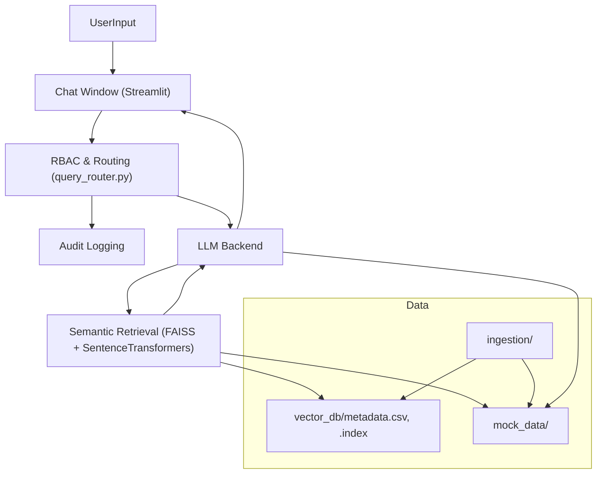
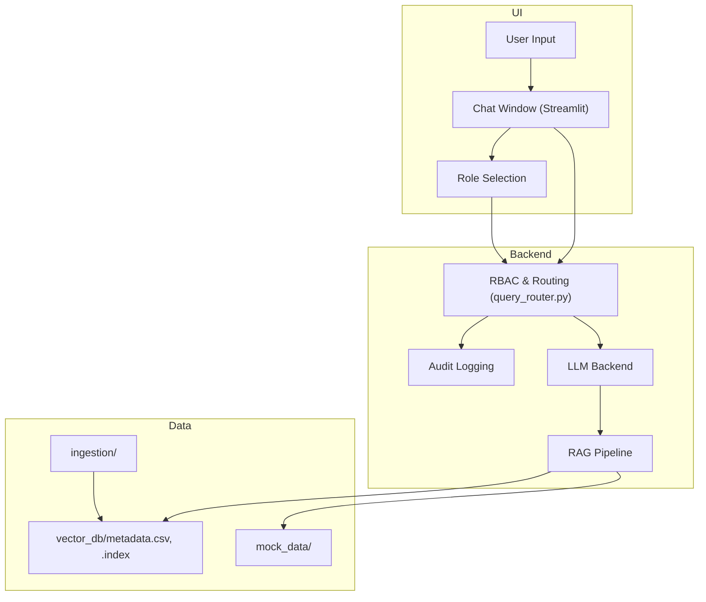
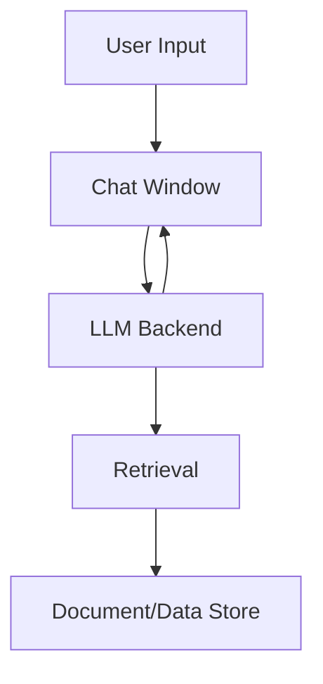

# System Architecture & Flow

**Major Features:**
- Enterprise-grade, typo-tolerant RBAC for all salary and sensitive queries
- Unified, modern Streamlit chat UI with persistent role/model display
- Role-preserved chat history (each message stores the role at time of sending)
- Advanced semantic search and retrieval (FAISS + SentenceTransformers)
- Robust audit logging and feedback metrics
- **Persistent query logging (CSV) for all user queries and responses**
- **Collapsible log viewer in UI with denial log filtering and selection**

## System Components
- **UI:** Streamlit-based chat interface (`ui/app.py`) with modern, right-aligned, bottom-aligned chat bubbles, persistent LLM/model display, and feedback controls
- **Sidebar:** About, Project Documentation, Tech Stack, System Design Notes, App Version (all styled and mobile-friendly)
- **LLM Integration:** Supports HuggingFace models and local Ollama (llama2:7b-chat, mistral, etc.), switchable via UI
- **Retrieval:** FAISS vector search with SentenceTransformers embeddings
- **Data:** CSV and local file-based document storage
- **Feedback & Logging:** Thumbs up/down voting, semantic similarity metrics, response time, LLM name display, and CSV logging (demo_results.csv)

**RBAC Logic:**
- HR: Sees all salaries
- CTO: Sees only Technology department salaries
- David Kim (Engineer): Sees only David Kim's salary (strict, typo-tolerant, all other salary queries blocked)

**Chat History:**
- Each chat bubble displays the role as it was when the message was sent, regardless of later role changes

## Key Design Principles
- Modular, extensible codebase
- Reproducible environments (requirements.txt, devcontainer)
- Secure secrets/configuration management (.env, .streamlit/secrets.toml)
- GitHub Actions for uptime and CI/CD
- Documentation-first: README, CHANGELOG, and architecture docs

## Deployment
- **Streamlit Cloud:** HuggingFace models only
- **Self-hosted/VM:** Full feature set with Ollama support
- **Dev Container:** VS Code + Docker for reproducible local development

## New in v0.11.0
- Strict, typo-tolerant RBAC for all salary and sensitive queries (HR: all, CTO: Technology only, David Kim: self only)
- Unified, modern chat UI with persistent role/model display and mobile-friendly sidebar
- Role-preserved chat history (each message stores the role at time of sending)
- Robust audit logging for all unauthorized access attempts
- All denials and fallbacks use a unified, branded HTML message
- Fully tested with pytest (RBAC, fallback, audit, typo-tolerance)
- Advanced semantic search and retrieval (FAISS + SentenceTransformers)
- Modular, extensible Python/Streamlit codebase

## Recent Updates (v0.11.0)
- Enterprise-grade, typo-tolerant RBAC for all salary and sensitive queries
- Unified, modern Streamlit chat UI with persistent role/model display
- Role-preserved chat history (each message stores the role at time of sending)
- Robust audit logging for all unauthorized access attempts
- All denials and fallbacks use a unified, branded HTML message
- Fully tested with pytest (RBAC, fallback, audit, typo-tolerance)
- Advanced semantic search and retrieval (FAISS + SentenceTransformers)
- Modular, extensible Python/Streamlit codebase

## Persistent Query Logging (v2.1.0)

- All user queries and responses are logged to a CSV file (`query_logs.csv`) for a persistent audit trail.
- On app startup, the Streamlit session state is initialized from the CSV log, ensuring all previous logs are loaded and visible in the UI.
- New queries are appended to both the session state and the CSV file, guaranteeing persistence across restarts.
- The log viewer UI allows filtering for denials and highlights denied queries.

**Flow:**
1. On app start, `load_query_logs()` reads `query_logs.csv` and populates `st.session_state['query_logs']`.
2. Each new query appends a log entry to both session state and the CSV file.
3. The log viewer displays all logs from session state, with options to filter and highlight denials.

## Diagrams
### Chat UI and Data Flow (Mermaid)

