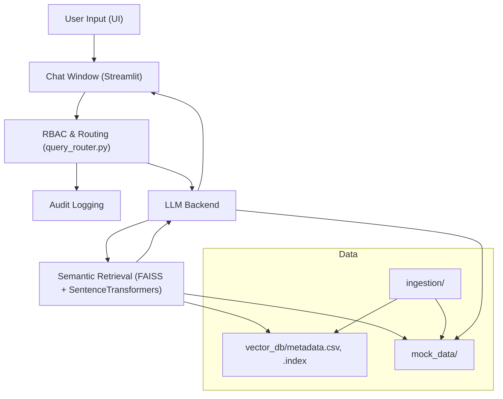

## 🖼️ System Diagram

> **Version:** v2.0.1 — March 2, 2026
**Version:** v2.2.0


# 🤖 Local AI Chatbot POC


A hands-on AI project for private, local document Q&A and semantic search, featuring a modern, production-ready Python/Streamlit stack. Includes a unified chat UI, sidebar with documentation, tech stack, and system design notes, and robust feedback logging. Inspired by [agentic-mortgage-research](https://github.com/obizues/agentic-mortgage-research).


## Portfolio Project
- Secure, local AI chatbot for enterprise document Q&A
- Strict role-based access control (RBAC) for sensitive data
- Real-time semantic search and retrieval
- Unified, modern chat UI with persistent role/model display
- Modular, extensible Python/Streamlit codebase
- Production-grade deployment and reproducible environments
- Robust feedback logging and evaluation
- **Persistent query logging and audit trail (CSV-based, loaded at startup for full persistence)**
- **Collapsible log viewer with denial log filtering and selection**

**Target Audience:**
Technology executives, technology leaders, HR professionals, AI/ML practitioners, and technical decision-makers interested in secure document Q&A, RBAC enforcement, and advanced LLM-driven systems for enterprise use cases.

**What This Demonstrates:**
- Deep LLM integration (Ollama, HuggingFace Transformers)
- Multi-role RBAC enforcement and salary logic
- Unified, modern chat UI with persistent role/model display
- Clean architecture, modular code, and documentation
- Technical leadership and system design for enterprise AI
- **Persistent, filterable audit logs for all queries and denials**

## 🚀 Quick Start

### Prerequisites
- Python 3.10+
- (Optional) Ollama installed for local LLM support

> **Version:** v1.0.4 — March 1, 2026

### Setup
1. Clone the repo:
   ```
   git clone https://github.com/obizues/Local-AI-Chatbot-POC.git
   cd Local-AI-Chatbot-POC
   ```
2. Install dependencies:
   ```
   pip install -r requirements.txt
   ```
3. (Optional) Configure secrets:
   - Copy `.env.example` to `.env` and set any required keys
   - Or copy `.streamlit/secrets.toml.example` to `.streamlit/secrets.toml`
4. Run the app:
   ```
   streamlit run ui/app.py
   ```

   (The new modern chat UI is integrated directly in ui/app.py. No need to use basic_chat.py. The `my_chat_component` folder has been removed as of v0.6.0.)


## 🚀 Features (v1.0.4)
- **Enterprise-Grade RBAC:** Strict, typo-tolerant role-based access control for all salary and sensitive queries. HR sees all, CTO sees only Technology, David Kim (Engineer) sees only his own salary. All denials and fallbacks use a unified, branded HTML message. All RBAC, fallback, and audit logic is fully tested (pytest).
- **Modern, Unified Chat UI:** Fully integrated Streamlit chat interface with persistent role/model display, right-aligned chat bubbles, and mobile-friendly design. Sidebar includes About, Docs, Tech Stack, System Design, and App Version.
- **Role-Preserved Chat History:** Every message stores and displays the user's role at the time of sending, even if the role changes later.
- **Advanced Semantic Search:** Real-time retrieval over internal documents (PDF, DOCX, TXT) using FAISS and SentenceTransformers. Supports both local (Ollama) and HuggingFace LLMs.
- **Production-Ready Logging:** Robust audit logging for all unauthorized access attempts, CSV logging of all interactions, semantic similarity and response time metrics, and feedback voting for continuous improvement.
- **Modular, Extensible Codebase:** Clean, well-documented Python/Streamlit architecture, ready for enterprise extension and deployment. Reproducible environments and secure secrets/configuration management.
- **Technical Leadership:** Demonstrates advanced system design, RBAC enforcement, and LLM integration for secure enterprise AI. Inspired by best practices from agentic-mortgage-research.
- **AI Search & Knowledge System:** RAG pipeline, semantic retrieval, and provenance/source display for all answers.
- **Brag-worthy:** Modern UI/UX, role-preserved chat, and seamless LLM/model switching. Devcontainer and GitHub Actions for reproducible development.
- Improvements tracker in sidebar


## 📦 Project Structure (as of v0.11.0)
- `ui/app.py` — Main Streamlit app (modern chat UI, RBAC, audit logic)
- `llm_backend/` — LLM and RAG pipeline code
- `ingestion/` — Data ingestion and chunking scripts
- `mock_data/` — Example documents
- `.devcontainer/` — VS Code devcontainer config
- `.github/workflows/` — GitHub Actions workflows
- `.streamlit/` — Streamlit secrets example
- `.env.example` — Example environment variables
- `ARCHITECTURE.md` — System architecture and design
- `CHANGELOG.md` — Release history

*Note: The `my_chat_component` folder has been removed as of v0.6.0. All chat UI is now in `ui/app.py` as of v0.8.0.*


## 🔒 Security Notes
- No API keys are committed
- Use `.env` or `.streamlit/secrets.toml` for secrets
- All secrets files are gitignored
- All RBAC, fallback, and audit logic is fully tested and typo-tolerant


## 📚 Further Reading
- [ARCHITECTURE.md](ARCHITECTURE.md)
- [CHANGELOG.md](CHANGELOG.md)
- [System Design Notes](ARCHITECTURE.md#system-components)
- [ui/app.py](ui/app.py) for modern chat UI and RBAC logic

## 📝 License
MIT License — see [LICENSE]
