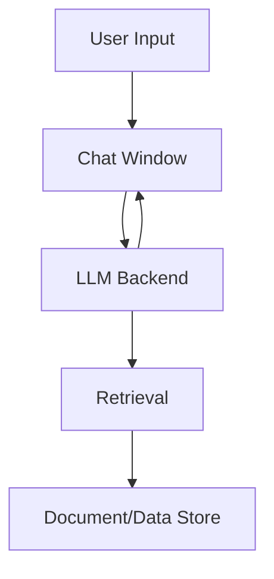

## 🖼️ System Diagram

## About This Project

Portfolio Project

This is a demonstration of a secure, local AI chatbot architecture designed for:

- Role-based access control (RBAC) for sensitive data
- Real-time document Q&A and semantic search
- Unified, modern chat UI with persistent role and model display
- Production-grade Python/Streamlit stack
- Modular, extensible codebase and reproducible environments
- System design thinking and technical leadership

**Target Audience:**
Technology executives, engineering leaders, HR professionals, AI/ML practitioners, and technical decision-makers interested in secure document Q&A, RBAC enforcement, and advanced LLM-driven systems for enterprise use cases.


> **Version:** v0.9.0 — February 22, 2026
- **Version:** v0.10.0 — February 23, 2026




# 🤖 Local AI Chatbot POC

A hands-on AI project for private, local document Q&A and semantic search, featuring a modern, production-ready Python/Streamlit stack. Includes a unified chat UI, sidebar with documentation, tech stack, and system design notes, and robust feedback logging. Inspired by [agentic-mortgage-research](https://github.com/obizues/agentic-mortgage-research).

## 🚀 Quick Start

### Prerequisites
- Python 3.10+
- (Optional) Ollama installed for local LLM support

> **Version:** v0.11.0 — February 23, 2026

### Setup
1. Clone the repo:
   ```
   git clone https://github.com/obizues/Local-AI-Chatbot-POC.git
   cd Local-AI-Chatbot-POC
   ```
2. Install dependencies:
   ```
   pip install -r requirements.txt
   ```
3. (Optional) Configure secrets:
   - Copy `.env.example` to `.env` and set any required keys
   - Or copy `.streamlit/secrets.toml.example` to `.streamlit/secrets.toml`
4. Run the app:
   ```
   streamlit run ui/app.py
   ```

   (The new modern chat UI is integrated directly in ui/app.py. No need to use basic_chat.py. The `my_chat_component` folder has been removed as of v0.6.0.)


## 🚀 Features (v0.9.0)
- Strict RBAC for salary and sensitive data (HR: all, CTO: Technology only, David Kim: self only)
- All salary responses are formatted as HTML tables
- CTO/HR queries for specific roles (e.g., CTO salary) return only that individual's salary
- Modern, unified Streamlit chat UI with colored header, sidebar, and persistent model display
- Sidebar: About, Project Documentation, Tech Stack, System Design Notes, App Version
- Conversational Q&A over your internal documents (PDF, DOCX, TXT)
- Semantic search and retrieval with FAISS and SentenceTransformers
- LLM support: Ollama (local) and HuggingFace Transformers (cloud/local)
- Feedback logging, semantic similarity, and response time metrics
- CSV logging of all interactions for evaluation
- Modular, extensible Python codebase
- Devcontainer and GitHub Actions for reproducible development
- Improvements tracker in sidebar

## 📦 Project Structure (as of v0.8.0)
- `ui/app.py` — Main Streamlit app (contains the new chat UI)
- `llm_backend/` — LLM and RAG pipeline code
- `ingestion/` — Data ingestion and chunking scripts
## 🚀 Features (v0.11.0)
- Strict RBAC for salary and sensitive data (HR: all, CTO: Technology only, David Kim: self only)
- All salary responses are formatted as HTML tables
- CTO/HR queries for specific roles (e.g., CTO salary) return only that individual's salary
- `mock_data/` — Example documents
- `.devcontainer/` — VS Code devcontainer config
- `.github/workflows/` — GitHub Actions workflows
- `.streamlit/` — Streamlit secrets example
- `.env.example` — Example environment variables
- `ARCHITECTURE.md` — System architecture and design
- `CHANGELOG.md` — Release history

*Note: The `my_chat_component` folder has been removed as of v0.6.0. All chat UI is now in `ui/app.py` as of v0.8.0.*

## 🔐 Security Notes
- No API keys are committed
- Use `.env` or `.streamlit/secrets.toml` for secrets
- All secrets files are gitignored

## 📚 Further Reading
- [ARCHITECTURE.md](ARCHITECTURE.md)
- [CHANGELOG.md](CHANGELOG.md)
- [System Design Notes](ARCHITECTURE.md#system-components)

## 📝 License
MIT License — see [LICENSE]
